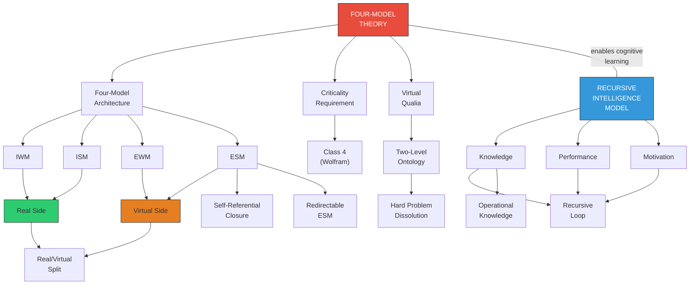

# Glossary of Terms

**Comprehensive definitions of all key terms used across the Four-Model Theory of Consciousness (FMT) and the Recursive Intelligence Model (RIM).**

---

## Core Architecture (FMT)

**Implicit World Model (IWM)**
: The substrate's total accumulated knowledge about the world, stored in synaptic weights (or their functional equivalent). Includes perceptual regularities, causal models, spatial relationships, semantic knowledge, motor programs. Never directly conscious. Part of the "real side." See [Implicit World Model](../core-architecture/iwm.md).

**Implicit Self Model (ISM)**
: The substrate's accumulated self-knowledge: body schema, proprioceptive calibration, motor skills, habits, personality traits, autobiographical memory structures. Never directly conscious. No inner homunculus. Part of the "real side." See [Implicit Self Model](../core-architecture/ism.md).

**Explicit World Model (EWM)**
: The conscious world — the brain's dynamic construction of a unified scene from sensory data and stored knowledge. Perceptual experience. Virtual, transient, generated from IWM and current input. Part of the "virtual side." See [Explicit World Model](../core-architecture/ewm.md).

**Explicit Self Model (ESM)**
: The conscious self — the brain's continuous generation of a unified self-narrative. The sense of being a subject, having a perspective, occupying a body. Virtual, transient, redirectable. Central to ego dissolution and DID. Part of the "virtual side." See [Explicit Self Model](../core-architecture/esm.md).

**Four-Model Architecture**
: The minimal architecture required for consciousness: four nested models arranged along two axes (scope and mode). Four is the floor, not the ceiling — the brain runs an effectively uncountable number of overlapping models, but any system capable of consciousness must model both world and self, at both the structural and simulation level. See [The Four-Model Theory](../foundations/overview.md).

**Real/Virtual Split**
: The foundational ontological division. Real side (IWM + ISM): physical, structural, learned, non-conscious. Virtual side (EWM + ESM): generated, transient, phenomenal. The virtual models have software-like properties: forkable, cloneable, redirectable, reconfigurable. See [The Real/Virtual Split](../core-architecture/real-virtual-split.md).

**Self-Referential Closure**
: The property that distinguishes conscious computation from other computation. The ESM models the system modeling itself, collapsing the inside/outside distinction. Experience is observation-from-inside-the-loop. A weather simulation models weather but not itself modeling weather — it has an "outside." A self-referential system has no such outside. See [Self-Referential Closure](../core-architecture/self-referential-closure.md).

## Hard Problem and Ontology

**Virtual Qualia**
: The theory's central claim: qualia are constitutive properties of the computational level — digital constructs that exist at the level of the running computation but are incoherent at the substrate level. "Redness" is the ESM's mode of registering a class of EWM content — no more mysterious than a spreadsheet cell's value is mysterious despite being nowhere in the transistors. See [Virtual Qualia](../hard-problem/virtual-qualia.md).

**Two-Level Ontology**
: The substrate level has no experience; the computational level has genuine experience. Both levels are physical. Not dualism — a level distinction within a single physical system. See [Two-Level Ontology](../hard-problem/two-level-ontology.md).

**Category Error (Level Confusion)**
: The specific error in the Hard Problem's formulation: seeking phenomenal properties at the substrate level where they categorically do not exist. Asking why neuronal firing feels like something is analogous to asking why transistor switching "is" a spreadsheet. See [The Category Error](../hard-problem/category-error.md).

**Process Physicalism**
: The theory's physicalist position. Consciousness is constituted by the *process* of self-simulation, not identical to any particular neural state. Both substrate and simulation are physical. No non-physical substance. See [Process Physicalism](../philosophical/process-physicalism.md).

**Explanatory Gap**
: The feeling that neural explanations leave something out ([Levine, 1983](https://doi.org/10.1111/j.1468-0114.1983.tb00207.x)). Dissolved by recognizing it as a reflection of the level distinction, not a gap in knowledge. See [The Explanatory Gap](../hard-problem/explanatory-gap.md).

## Physical Foundations

**Criticality (Edge of Chaos)**
: The computational regime (Wolfram's Class 4) required for consciousness. The substrate must operate at the boundary between order and chaos — complex enough to sustain self-simulation, ordered enough for coherence. See [The Criticality Requirement](../physical-foundations/criticality.md).

**Wolfram's Class 4**
: The fourth class in Wolfram's classification of cellular automata: complex, structured, non-repeating patterns capable of universal computation. The only class that supports the dynamics required for consciousness. See [Wolfram's Four Classes](../physical-foundations/wolfram-classes.md).

**Cortical Automaton**
: The instantaneous pattern of neural firing across the cortex, interpreted as a literal cellular automaton. Cortical columns as cells, six-layer architecture and lateral connectivity as transition rules, operating in a many-thousand-dimensional space. Not consciousness itself, but the computational medium. See [The Cortical Automaton](../physical-foundations/cortical-automaton.md).

**Five-System Hierarchy**
: Five nested levels in the brain: (1) Physical, (2) Electrochemical, (3) Proteomic, (4) Topological (where implicit models are stored), (5) Virtual (where consciousness exists). Each level fully physical and fully determined by the level below. See [Five-System Hierarchy](../physical-foundations/five-system-hierarchy.md).

**Two Thresholds**
: Both required for consciousness: (1) Computational threshold — criticality (Class 4 dynamics). (2) Architectural threshold — four-model architecture. Neither alone is sufficient; together they are sufficient. See [Two Thresholds](../physical-foundations/two-thresholds.md).

## Key Mechanisms

**Implicit-Explicit Boundary**
: The selectively permeable boundary between implicit models (substrate) and explicit models (simulation). Information becomes conscious when transferred across this boundary. Variable permeability explains psychedelics, anosognosia, pre-sleep imagery, meditation. See [The Implicit-Explicit Boundary](../mechanisms/implicit-explicit-boundary.md).

**Variable Permeability**
: The central explanatory mechanism. The implicit-explicit boundary's permeability is dynamically variable: global increases (psychedelics), local decreases (anosognosia), gradual changes (pre-sleep), trained modulation (meditation). See [Variable Permeability](../mechanisms/variable-permeability.md).

**Redirectable ESM**
: The ESM requires input. Disrupt normal self-referential input and it latches onto dominant sensory input. Explains ego dissolution and salvia divinorum "becoming" experiences. See [The Redirectable ESM](../mechanisms/redirectable-esm.md).

**Virtual Model Forking**
: The virtual models can be forked — a single substrate running multiple ESM configurations simultaneously. Explains DID (multiple alters as distinct ESM configurations on the same substrate). See [Virtual Model Forking](../mechanisms/virtual-model-forking.md).

**Holographic Storage**
: The implicit models store information in a distributed manner: each part contains a degraded version of the whole. Explains split-brain bilateral degradation rather than clean hemispheric division. See [Holographic Storage](../mechanisms/holographic-storage.md).

**Graduated Consciousness**
: Consciousness is not binary but graduated: basic (minimal self-simulation), simply extended (first-order self-observation), doubly extended (metacognition), triply extended (philosophical reflection). See [Graduated Levels](../mechanisms/graduated-consciousness.md).

## Intelligence (RIM)

**Knowledge (Wissen)**
: One of three RIM components. Accumulated content of learning, including both factual knowledge (content) and operational knowledge (how to learn). Corresponds roughly to Cattell's Gc. See [The Three Components](../intelligence/three-components.md).

**Performance (Leistung)**
: One of three RIM components. Processing capacity of the cognitive system: working memory capacity, processing speed, computational power. Corresponds roughly to Cattell's Gf. See [The Three Components](../intelligence/three-components.md).

**Motivation**
: One of three RIM components. Sustained drive to engage with the world. Two sub-components: *Wissensdrang* (thirst for knowledge) and *Handlungsdrang* (urge to act). The systematically excluded component. See [The Three Components](../intelligence/three-components.md).

**Wissensdrang**
: Thirst for knowledge — the intrinsic drive to understand, learn, and make sense of the world. Aligns with need for cognition ([Cacioppo et al., 1996](https://doi.org/10.1207/s15327957pspr0104_2)) and intrinsic motivation ([Deci & Ryan, 2000](https://doi.org/10.1037/0003-066X.55.1.68)).

**Handlungsdrang**
: Urge to act — the drive to apply knowledge, experiment, and engage actively with the environment. Partly genetic, partly shaped by conditioning and learning.

**Operational Knowledge (Metawissen)**
: Knowledge about *how to learn and think* — learning strategies, reasoning heuristics, metacognitive skills. Functions as the primary *multiplier* within the recursive loop: it accelerates the rate of all subsequent learning. See [Operational Knowledge](../intelligence/operational-knowledge.md).

**Recursive Loop**
: The closed amplification loop: K enhances P (learning strategies improve processing), P enhances K (capacity enables deeper learning), M enhances both (sustained engagement), success enhances M (self-efficacy). See [The Recursive Loop](../intelligence/recursive-loop.md).

**Cognitive Learning**
: The induction of general theories from particular observations — as distinct from reinforcement learning (trial-and-error). Requires explicit self-modeling (consciousness). The capacity that enables the recursive intelligence loop. See [Cognitive Learning vs. Reinforcement Learning](../bridge/cognitive-vs-reinforcement.md).

**Substrate Independence**
: Consciousness depends on function (four models at criticality), not on material (biological neurons). The six-layer mammalian cortex is an evolutionary implementation, not a requirement. See [Substrate Independence](../philosophical/substrate-independence.md).

## Concept Map

*Concept map of the key terms and their relationships. FMT (red) provides the consciousness architecture; RIM (blue) provides the intelligence model. They are connected through cognitive learning — the capacity that consciousness enables and that drives the recursive intelligence loop.*

## Key Takeaway

The theory introduces a precise technical vocabulary. Terms like "virtual qualia," "real/virtual split," and "operational knowledge" have specific definitions that differ from casual usage. This glossary is the reference for their exact meanings within the framework.

## See Also

- [The Four-Model Theory](../foundations/overview.md)
- [The Recursive Intelligence Model](../intelligence/overview.md)
- [Reading Order Guide](reading-order.md)

---

Based on: Gruber, M. (2026). The Four-Model Theory of Consciousness. Zenodo. https://doi.org/10.5281/zenodo.19064950; Gruber, M. (2026). Why Intelligence Models Must Include Motivation. PsyArXiv. https://osf.io/preprints/osf/kctvg
