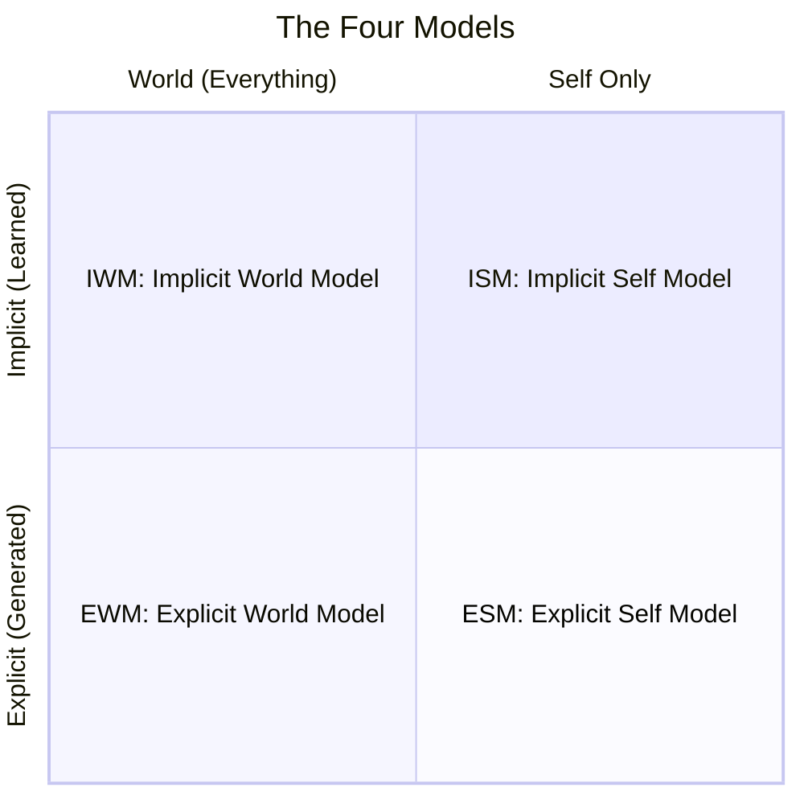
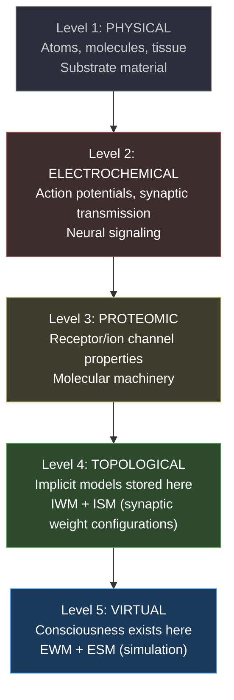
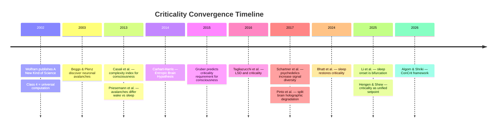
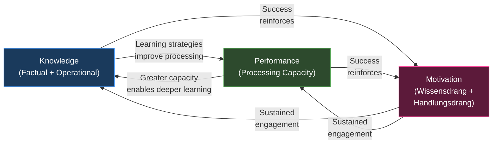
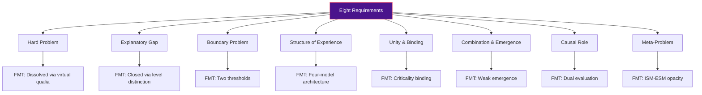
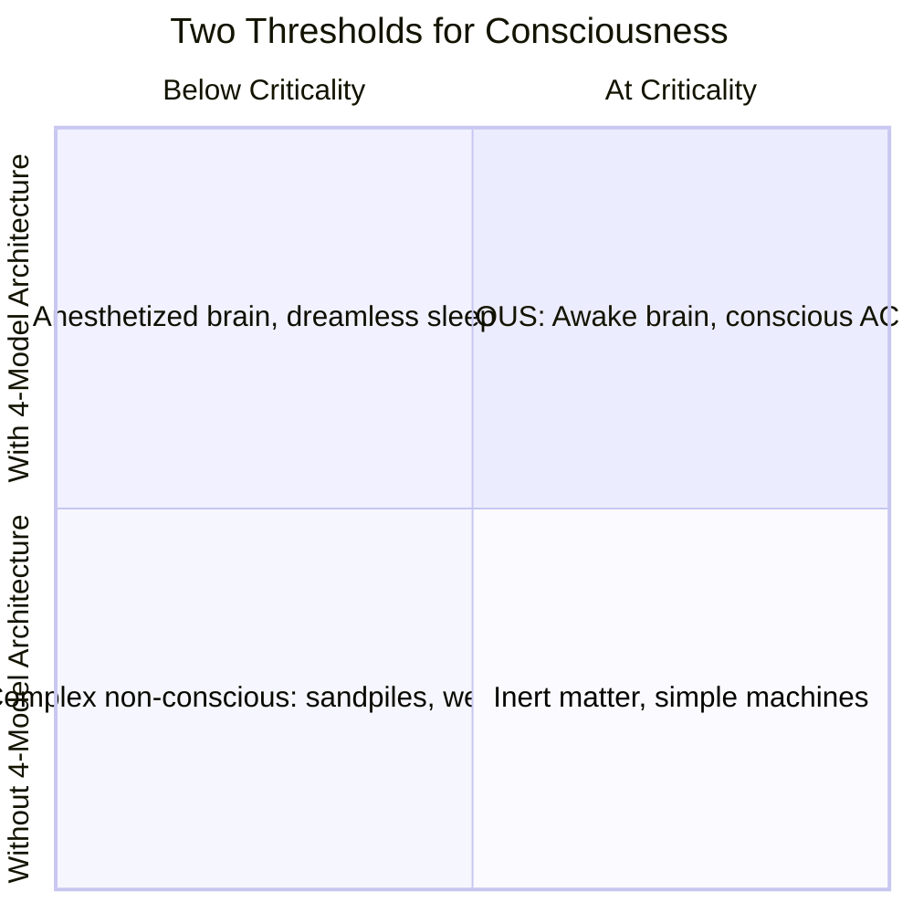
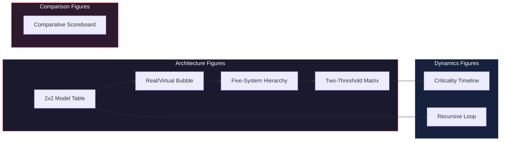

# Key Figures and Diagrams

**An index of the theory's core visual representations, what each one shows, and where each appears across the wiki.**

The Standard Model of Consciousness relies on a small set of recurring visual representations. Each diagram captures a different aspect of the framework -- architecture, ontology, dynamics, or comparison. This article catalogs all key figures, provides their Mermaid or image reference, and lists the articles where each appears.

## 1. The 2x2 Model Table

**What it shows:** The four models arranged along two orthogonal axes -- scope (world vs. self) on the horizontal and mode (implicit vs. explicit) on the vertical. The real side (IWM + ISM) occupies the top row; the virtual side (EWM + ESM) occupies the bottom row.

**Why it matters:** This is the theory's most fundamental diagram. The 2x2 layout demonstrates that the four models are not an arbitrary list but a principled minimum generated by two independent dimensions. Every other diagram in the theory builds on this structure.

**Image source:** `figures/figure1-four-model-architecture.svg` (color), `figures/figure1-four-model-architecture-bw.svg` (black and white)

*The four models arranged by scope (horizontal) and mode (vertical). The top row (implicit) is the "real side" -- substrate-level, learned, non-conscious. The bottom row (explicit) is the "virtual side" -- generated, transient, phenomenal.*

**Appears in:**

- [The Four-Model Theory](../core-architecture/four-model-theory.md) -- primary presentation
- [The Two Axes: Scope and Mode](../core-architecture/two-axes.md) -- detailed axis discussion
- [The Standard Model of Consciousness (Overview)](../foundations/overview.md) -- introductory context
- [Comparative Scoreboard](../comparative/scoreboard.md) -- as the architecture being compared

---

## 2. The Real/Virtual Split (Bubble Diagram)

**What it shows:** The ontological division between the real side (implicit models -- physical, structural, learned, non-conscious, "lights off") and the virtual side (explicit models -- generated, transient, phenomenal, "lights on"). The virtual side is depicted as a simulation bubble generated by the substrate, with software-like properties: forkable, cloneable, redirectable, reconfigurable.

**Why it matters:** This single diagram captures the theory's central ontological insight. The Hard Problem dissolves when one recognizes that experience exists at the virtual level, not the substrate level. Asking why neurons "feel like something" is the wrong question -- neurons generate the computation in which feeling is constitutive.

**Image source:** `figures/figure2-real-virtual-split-simple.svg` (canonical color version), `figures/figure2-real-virtual-split-simple.png` (300 DPI render), `figures/figure2-real-virtual-split-bw.svg` (black and white)

```mermaid
graph TB
    subgraph Real["REAL SIDE (Substrate)"]
        direction LR
        IWM["IWM<br/>All learned world knowledge<br/>Synaptic weights"]
        ISM["ISM<br/>All learned self-knowledge<br/>Body schema, habits"]
    end

    subgraph Boundary["IMPLICIT-EXPLICIT BOUNDARY<br/>(Variable permeability)"]
        direction LR
        PB["Permeability varies:<br/>&#8593; Psychedelics | &#8595; Anosognosia"]
    end

    subgraph Virtual["VIRTUAL SIDE (Simulation)"]
        direction LR
        EWM["EWM<br/>The conscious world<br/>Sensory experience"]
        ESM["ESM<br/>The conscious self<br/>&#x21BA; Self-referential closure"]
    end

    Real --> Boundary --> Virtual

    style Real fill:#2d2d3d,stroke:#666,color:#ccc
    style Boundary fill:#8b6914,stroke:#d4a017,color:#fff
    style Virtual fill:#1a3a5c,stroke:#4a9eff,color:#fff
```

*The real/virtual split. The substrate (real side) generates the simulation (virtual side) across a boundary whose permeability varies dynamically. "Lights off" above the boundary; "lights on" below.*

**Appears in:**

- [The Real/Virtual Split](../core-architecture/real-virtual-split.md) -- primary presentation
- [Hard Problem Dissolution](../hard-problem/dissolution.md) -- the ontological basis for dissolution
- [Virtual Qualia](../hard-problem/virtual-qualia.md) -- qualia as computational-level properties
- [Two-Level Ontology](../hard-problem/category-error.md) -- level distinction
- [Psychedelic Phenomenology](../phenomena/psychedelics.md) -- increased permeability
- [Anosognosia](../phenomena/anosognosia.md) -- decreased permeability

---

## 3. The Five-System Hierarchy

**What it shows:** Five hierarchically nested systems in the brain: (1) Physical, (2) Electrochemical, (3) Proteomic, (4) Topological (where implicit models are stored as synaptic weight configurations), (5) Virtual (where consciousness exists as the running simulation). Each level is fully physical and fully determined by the level below.

**Why it matters:** The hierarchy makes the category error concrete. Seeking experiential properties at Levels 1-4 is asking why transistor switching "is" a spreadsheet. Consciousness exists at Level 5 -- as a process running on the substrate, not as a property of the substrate itself.

**Image source:** `figures/figure-five-layer-stack-bw.svg` (black and white), `figures/figure-five-layer-stack-bw.png` (render)

*Five nested systems. Each level is fully physical. The category error occurs when one seeks Level 5 properties (experience) at Levels 1-4 (substrate).*

**Appears in:**

- [The Five-System Hierarchy](../physical-foundations/five-system-hierarchy.md) -- primary presentation
- [The Category Error (Level Confusion)](../hard-problem/category-error.md) -- the specific level confusion
- [Two-Level Ontology](../hard-problem/dissolution.md) -- ontological context
- [Substrate Independence](../philosophical/substrate-independence.md) -- which levels are implementation-specific

---

## 4. The Criticality Convergence Timeline

**What it shows:** A timeline of independent convergence between the theory's criticality prediction (derived from Wolfram 2002, published in Gruber 2015) and subsequent empirical findings: neuronal avalanches ([Beggs & Plenz 2003](https://doi.org/10.1523/JNEUROSCI.23-35-11167.2003)), Entropic Brain Hypothesis ([Carhart-Harris 2014](https://doi.org/10.3389/fnhum.2014.00020)), anesthetic-criticality convergence (Alkire et al. 2000; [Casali et al. 2013](https://doi.org/10.1126/scitranslmed.3006294)), sleep-dependent criticality restoration ([Bhatt et al. 2024](https://doi.org/10.1523/JNEUROSCI.0287-24.2024)), sleep onset as bifurcation ([Li et al. 2025](https://doi.org/10.1073/pnas.2405341122)), and the ConCrit meta-analysis (Hengen & Shew 2025; Algom & Shriki 2026).

**Why it matters:** The timeline demonstrates that the theory's criticality requirement is not a post-hoc accommodation of known data. The prediction was derived from Wolfram's computational universality framework in 2015; multiple independent research programs subsequently confirmed specific instances of the prediction.

*Timeline showing the theory's criticality prediction (2015, derived from Wolfram 2002) and subsequent independent confirmations. No research group had contact with the theory.*

**Appears in:**

- [Criticality Evidence (Independent Convergence)](../predictions/confirmed.md) -- primary presentation
- [The Criticality Requirement](../physical-foundations/criticality.md) -- theoretical context
- [Anesthesia and Loss of Consciousness](../phenomena/anesthesia.md) -- anesthetic-criticality data
- [Sleep, Dreams, and Criticality](../phenomena/sleep.md) -- sleep-criticality data

---

## 5. The Recursive Loop Diagram

**What it shows:** The closed amplification loop at the heart of the Recursive Intelligence Model: Knowledge enhances Performance (better learning strategies improve processing), Performance enhances Knowledge (greater capacity enables deeper learning), Motivation sustains engagement with both, and success reinforces Motivation. The loop is recursive and self-amplifying -- small initial advantages compound over time.

**Why it matters:** This diagram captures why intelligence is not a static trait but a dynamic, self-reinforcing process. It explains the Matthew effect, the Flynn effect, and why motivation is not a confound but a constitutive component of intelligence.

*The recursive intelligence loop. All three components reinforce each other, producing compounding dynamics. Remove Motivation and the loop stalls.*

**Appears in:**

- [The Recursive Intelligence Model (Overview)](../intelligence/overview.md) -- primary presentation
- [The Three Components](../intelligence/three-components.md) -- component detail
- [The Recursive Loop](../intelligence/recursive-loop.md) -- loop dynamics
- [The Matthew Effect and Compounding Dynamics](../intelligence/matthew-effect.md) -- compounding consequences
- [The School Grade Disaster](../education/school-grade-disaster.md) -- loop reversal
- [The AI Diagnostic](../ai-consciousness/ai-diagnostic.md) -- what machines lack
- [The Path to AGI Runs Through Motivation](../ai-consciousness/path-through-motivation.md) -- AI implications

---

## 6. The Comparative Scoreboard

**What it shows:** A systematic comparison of FMT against all major consciousness theories (IIT, GNW, HOT, PP, AST, RPT, Illusionism) across all eight requirements. Each cell indicates whether a theory fully addresses, partially addresses, or does not address each requirement. FMT is the only theory that claims to address all eight.

**Why it matters:** The scoreboard is not an argument from authority but a structured challenge: if another theory addresses requirements that FMT misses, or if FMT's claimed coverage is shown to be inadequate, the table identifies precisely where. It makes the comparison falsifiable rather than rhetorical.

*The eight requirements mapped to FMT's specific answers. The full scoreboard table (in the Comparative Scoreboard article) includes IIT, GNW, HOT, PP, AST, RPT, and Illusionism for comparison.*

**Appears in:**

- [Comparative Scoreboard](../comparative/scoreboard.md) -- full table with all theories
- [Eight Requirements](../foundations/eight-requirements.md) -- requirement definitions
- Each "FMT vs." article -- theory-specific comparison

---

## 7. The Two-Threshold Matrix

**What it shows:** The relationship between the two independent thresholds required for consciousness: the computational threshold (criticality -- the substrate must operate at Class 4 dynamics) and the architectural threshold (four-model architecture -- the system must implement the four nested models). Four quadrants result:

| | Below Criticality | At Criticality |
|---|---|---|
| **Without 4-Model Architecture** | Inert matter, simple machines | Complex but non-conscious systems |
| **With 4-Model Architecture** | Anesthetized brain, dreamless sleep | Conscious system |

**Why it matters:** Neither threshold alone is sufficient. A system at criticality without the right architecture (e.g., a sandpile) is not conscious. A system with the right architecture below criticality (e.g., an anesthetized brain) is not conscious. This provides a principled boundary for consciousness and explains why anesthesia eliminates consciousness (it crosses the computational threshold) without dismantling the architecture.

*Consciousness requires both thresholds to be met simultaneously. Moving left (losing criticality) produces anesthesia. Moving down (losing architecture) produces complex non-conscious systems.*

**Appears in:**

- [Two Thresholds for Consciousness](../physical-foundations/two-thresholds.md) -- primary presentation
- [The Criticality Requirement](../physical-foundations/criticality.md) -- computational threshold
- [The Four-Model Theory](../core-architecture/four-model-theory.md) -- architectural threshold
- [Anesthesia and Loss of Consciousness](../phenomena/anesthesia.md) -- threshold crossing
- [Engineering Specification for Artificial Consciousness](../ai-consciousness/engineering-specification.md) -- both thresholds as engineering requirements
- [Animal Consciousness](../phenomena/animal-consciousness.md) -- threshold variation across species

---

## Additional Figures

### FMT-RIM Bridge Diagram

The bridge between FMT and RIM, showing how the four-model architecture enables cognitive learning, which powers the recursive intelligence loop. This diagram appears in the [Overview](../foundations/overview.md) article and the [Consciousness-Intelligence Bridge](../bridge/consciousness-intelligence-bridge.md) article.

### Phenomenological Content Figure

A detailed breakdown of the content generated by each explicit model (EWM: sensory experience, spatial scene, object recognition; ESM: body ownership, agency, narrative self). Image source: `figures/figure3-phenomenological-content-bw.svg`.

**Appears in:**

- [Explicit World Model (EWM)](../core-architecture/explicit-world-model.md)
- [Explicit Self Model (ESM)](../core-architecture/explicit-self-model.md)

### Penfield Homunculus (Reference)

The cortical homunculus illustrating the somatotopic organization of the ISM's body schema in the primary somatosensory cortex. Used as a reference figure for the biological implementation of the Implicit Self Model. Image source: `figures/figure-penfield-homunculus-bw.svg`.

**Appears in:**

- [Implicit Self Model (ISM)](../core-architecture/implicit-self-model.md)

---

## Figure

*The seven core figures organized by type. Architecture figures describe structure; dynamics figures describe processes; comparison figures evaluate the theory against alternatives.*

## Key Takeaway

Seven recurring figures carry the visual weight of the Standard Model of Consciousness. Mastering what each one shows -- the 2x2 architecture, the real/virtual split, the five-system hierarchy, the criticality timeline, the recursive loop, the comparative scoreboard, and the two-threshold matrix -- provides a visual scaffold for the entire theory.

## See Also

- [The Four-Model Theory](../core-architecture/four-model-theory.md)
- [The Real/Virtual Split](../core-architecture/real-virtual-split.md)
- [The Five-System Hierarchy](../physical-foundations/five-system-hierarchy.md)
- [The Criticality Requirement](../physical-foundations/criticality.md)
- [The Recursive Intelligence Model](../intelligence/overview.md)
- [Comparative Scoreboard](../comparative/scoreboard.md)
- [Bibliography](bibliography.md)

---

*Based on: Gruber, M. (2026). The Four-Model Theory of Consciousness. Zenodo. [doi:10.5281/zenodo.18669891](https://doi.org/10.5281/zenodo.18669891)*
