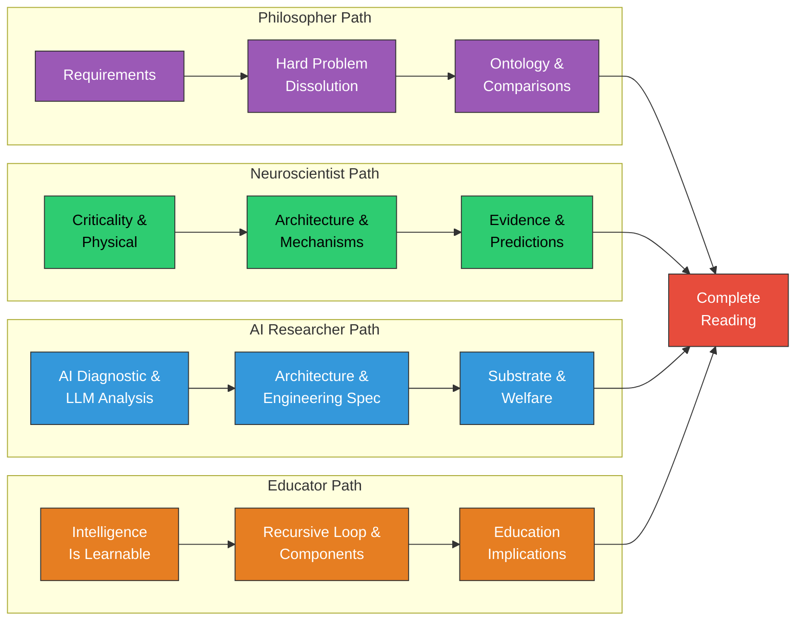

# Reading Order Guide

**Four audience-specific paths through the wiki, each designed to build understanding in the order that makes most sense for that reader's background and interests.**

The wiki contains 100 articles across 17 sections. No one needs to read all of them. The paths below select and sequence the most relevant articles for each audience, building from familiar ground toward the theory's distinctive claims.

## Path 1: Philosopher (15 articles)

Start with the problems, then see how the theory dissolves them.

1. [Eight Requirements](../foundations/eight-requirements.md) — The evaluative framework
2. [The Pre-Paradigm State](../foundations/pre-paradigm.md) — Why no theory has succeeded
3. [The Four-Model Theory](../foundations/overview.md) — The core proposal
4. [Core Definition of Consciousness](../core-architecture/core-definition.md) — Process, not property
5. [The Real/Virtual Split](../core-architecture/real-virtual-split.md) — The foundational division
6. [Virtual Qualia](../hard-problem/virtual-qualia.md) — The central claim
7. [Hard Problem Dissolution](../hard-problem/dissolution.md) — The category error
8. [The Explanatory Gap](../hard-problem/explanatory-gap.md) — Closes simultaneously
9. [Two-Level Ontology](../hard-problem/two-level-ontology.md) — Not dualism
10. [The Category Error](../hard-problem/category-error.md) — The level confusion
11. [The Meta-Problem Dissolved](../hard-problem/meta-problem.md) — Why mystery persists
12. [Process Physicalism](../philosophical/process-physicalism.md) — The philosophical position
13. [Not Illusionism, Not Deflationary](../philosophical/not-illusionism.md) — What the theory is *not*
14. [Consciousness as Process](../philosophical/consciousness-as-process.md) — Causal role clarified
15. [Comparative Scoreboard](../comparative/scoreboard.md) — How FMT fares against all eight requirements

**After completing this path:** Continue with [Weak Emergence](../philosophical/weak-emergence.md), [Substrate Independence](../philosophical/substrate-independence.md), and the individual theory comparisons (Articles 55-62).

## Path 2: Neuroscientist (12 articles)

Start with the physical foundations and empirical evidence, then see the explanatory range.

1. [The Criticality Requirement](../physical-foundations/criticality.md) — The computational prerequisite
2. [Wolfram's Four Classes](../physical-foundations/wolfram-classes.md) — The classification
3. [The Cortical Automaton](../physical-foundations/cortical-automaton.md) — The physical interpretation
4. [Five-System Hierarchy](../physical-foundations/five-system-hierarchy.md) — Where consciousness sits
5. [Criticality Evidence](../predictions/criticality-evidence.md) — Independent convergence
6. [The Four-Model Theory](../foundations/overview.md) — The architecture
7. [The Four Models](../core-architecture/four-models.md) — IWM, ISM, EWM, ESM
8. [Variable Permeability](../mechanisms/variable-permeability.md) — The explanatory mechanism
9. [Psychedelic Phenomenology](../phenomena/psychedelics.md) — The permeability account
10. [Anesthesia and Loss of Consciousness](../phenomena/anesthesia.md) — Propofol vs. ketamine
11. [Confirmed Predictions](../predictions/confirmed.md) — Post-2015 convergence
12. [Information-Theoretic Measures](../formal/information-theoretic.md) — How to test criticality

**After completing this path:** Continue with [Sleep, Dreams, and Criticality](../phenomena/sleep.md), [Split-Brain Phenomena](../phenomena/split-brain.md), [Prediction 1: Psychedelics Alleviate Anosognosia](../predictions/prediction-1.md), and [Prediction 4: Lucid Dream Onset](../predictions/prediction-4.md).

## Path 3: AI Researcher (10 articles)

Start with what current AI is missing, then see the engineering specification.

1. [The AI Diagnostic](../ai-consciousness/ai-diagnostic.md) — What machines lack
2. [Why LLMs Are Not Conscious](../ai-consciousness/llms-not-conscious.md) — Under FMT
3. [Two Thresholds for Consciousness](../physical-foundations/two-thresholds.md) — The dual criteria
4. [The Four-Model Theory](../foundations/overview.md) — The architecture
5. [The Real/Virtual Split](../core-architecture/real-virtual-split.md) — Substrate vs. computation
6. [Engineering Specification for AC](../ai-consciousness/engineering-specification.md) — The blueprint
7. [Substrate Independence](../philosophical/substrate-independence.md) — Function, not material
8. [Multi-Level Substrate Architecture](../open-questions/multi-level-substrate.md) — Which levels matter
9. [The Path to AGI Runs Through Motivation](../ai-consciousness/path-through-motivation.md) — Why scaling fails
10. [AI Welfare and Consciousness Criteria](../ai-consciousness/ai-welfare.md) — Ethical implications

**After completing this path:** Continue with [Consciousness-Intelligence Bridge](../bridge/consciousness-intelligence.md), [Cognitive Learning vs. Reinforcement Learning](../bridge/cognitive-vs-reinforcement.md), and [The Recursive Intelligence Model](../intelligence/overview.md).

## Path 4: Educator (8 articles)

Start with the practical implications, then understand the theoretical backing.

1. [Intelligence Is Learnable](../education/intelligence-learnable.md) — The structural prediction
2. [The Three Components](../intelligence/three-components.md) — Knowledge, Performance, Motivation
3. [The Recursive Loop](../intelligence/recursive-loop.md) — How they interact
4. [Operational Knowledge](../intelligence/operational-knowledge.md) — The hidden multiplier
5. [The School Grade Disaster](../education/school-grade-disaster.md) — How grades break the loop
6. [Compounding Effects](../education/compounding-effects.md) — Why early interventions grow
7. [Educational Implications](../education/educational-implications.md) — What to do differently
8. [The Matthew Effect](../intelligence/matthew-effect.md) — Why the rich get richer

**After completing this path:** Continue with [Performance Is Not the Bottleneck](../intelligence/performance-bottleneck.md), [Gf-Gc Divergence](../intelligence/gf-gc-divergence.md), and [The Flynn Effect](../intelligence/flynn-effect.md).

## Complete Reading Order

For readers who want to understand the entire framework, proceed through the sections in this order:

1. **Foundations** (Articles 1-4) — Context and requirements
2. **Core Architecture** (Articles 5-14) — The four models and their relationships
3. **Dissolving the Hard Problem** (Articles 15-20) — The philosophical core
4. **Physical Foundations** (Articles 21-26) — Criticality and evidence
5. **Key Mechanisms** (Articles 27-33) — How the theory explains phenomena
6. **Philosophical Commitments** (Articles 34-38) — The theory's positions
7. **Explanatory Range** (Articles 39-48) — Phenomena unified
8. **Predictions** (Articles 49-53) — Empirical program
9. **Comparative Analysis** (Articles 54-62) — Against rival theories
10. **Intelligence** (Articles 63-72) — The Recursive Intelligence Model
11. **Consciousness-Intelligence Bridge** (Articles 73-75) — How they connect
12. **AI and Artificial Consciousness** (Articles 76-80) — Engineering implications
13. **Education** (Articles 81-84) — Societal implications
14. **Formal Foundations** (Articles 85-88) — Mathematical frontiers
15. **Open Questions** (Articles 89-93) — Research frontiers
16. **Limitations** (Articles 94-96) — Intellectual honesty
17. **Reference** (Articles 97-100) — Glossary, bibliography, this guide

## Figure

*Four audience-specific paths through the wiki. Each path starts from the reader's likely entry point and builds toward the theory's core. All paths converge on the complete reading order for readers who want the full picture. Philosopher (purple): problems first. Neuroscientist (green): evidence first. AI Researcher (blue): engineering first. Educator (orange): implications first.*

## Key Takeaway

Start where your expertise is, read what your questions demand, and follow cross-links when curiosity pulls you sideways. The wiki is designed for non-linear exploration — these paths are recommendations, not requirements.

## See Also

- [Glossary of Terms](glossary.md)
- [Key Figures and Diagrams](../reference/figures.md)
- [Bibliography](../reference/bibliography.md)

---

Based on: Gruber, M. (2026). The Four-Model Theory of Consciousness. Zenodo. https://doi.org/10.5281/zenodo.18669891; Gruber, M. (2026). Why Intelligence Models Must Include Motivation. PsyArXiv. https://osf.io/preprints/osf/kctvg
